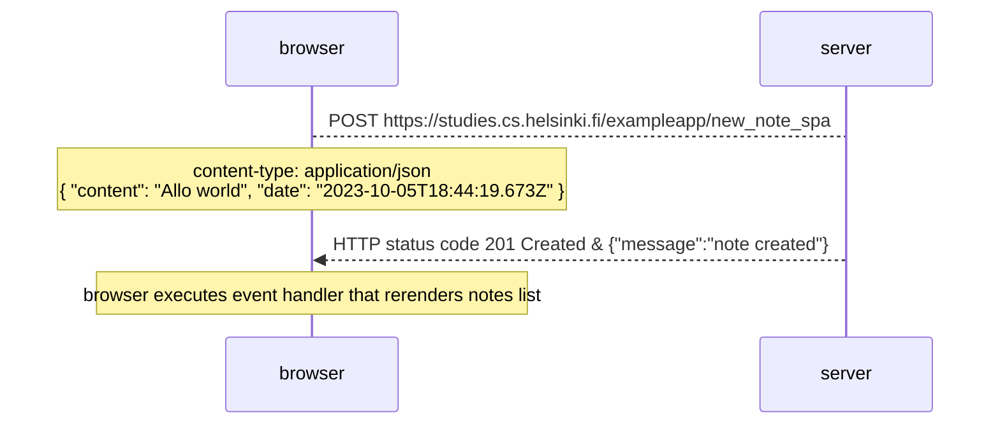

```mermaid

sequenceDiagram
participant browser
participant server

browser-->server: POST https://studies.cs.helsinki.fi/exampleapp/new_note_spa
note over browser: content-type: application/json <br>{ "content": "Allo world", "date": "2023-10-05T18:44:19.673Z" }
server-->>browser: HTTP status code 201 Created & {"message":"note created"}
note over browser: browser executes event handler that rerenders notes list

```